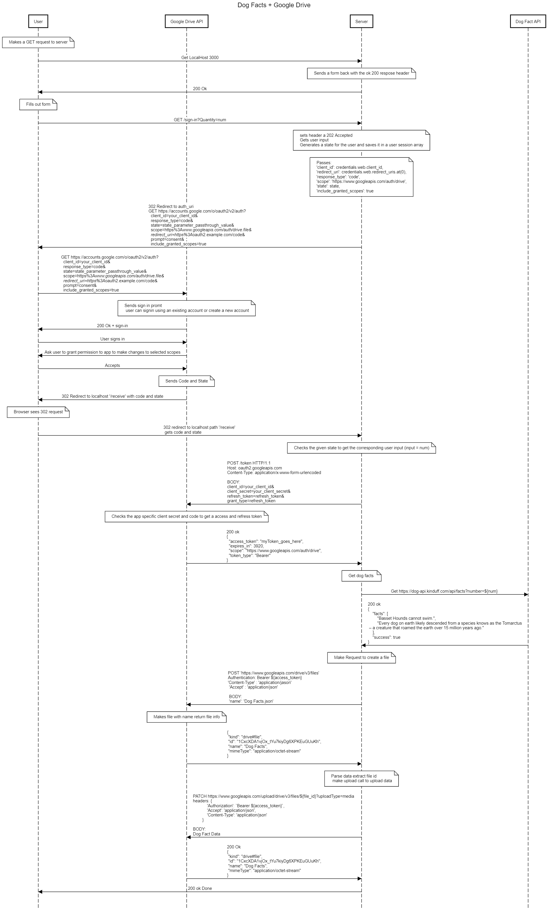

# API Mashup

This project makes use of 2 different api's and calls them synchronously to perform a task. 

### Requrements 

1) When a end user visits the home page, the server send them a form to fill out.

2) When a end user submits the form to the server, the server will then send the first API request out (using the captured data if necessary).

3) Upon receiving the response from the first API request, the server will parse the response and generate a request to the second API.

   The server makes all the requests to the API.

4) Upon receiving the response from the second API request, the server will parse the response and finally send results back to the end user.

### Restrictions

* Third party modules are not used. (Ex:  npm)
* Use only http/ https Node.js modules
* Only libraries avilible on nodejs.org are used
* Promise, Fetch, and Async/Away are not used
* setTimeout is not used

### Information about the project

The 2 API's for this project are:

Dog Facts API:

[https://github.com/kinduff/dog-api](https://github.com/kinduff/dog-api)

Google Drive API: 

[https://developers.google.com/drive/api/guides/about-sdk](https://developers.google.com/drive/api/guides/about-sdk)

Librabies:

- fs - file system
- http - for http server and api calls
- https - for https api calls
- crypto - used to generate a random number related to user session
- querystring - querying url params
- URLSearchParams - querying url params

### How the application works 

Premise: User wants to get random dog facts and save it in their google drive.

User makes the a request to the local host server, in return the server will send a form to the user to fill out, the user fills the form out indicating how many dog facts they would like to get.

The server get the user data and generates a random hexidecimal numebr refered to as state to associate the user to their input. This state and the user input is saved in an user session array that holds such information for multiple users who are making request to the server at the same time.

For this project we want to get the data (dog facts) and then put that data somewhere (google drive). Before we can get the data we can promt the user to sign in to their google account, and give the app the permission to make changes to the drive scope spcified for the project. 

We can do this 3 legged 2.0 authentication process and then follow up by getting the user data using the state the google drive signin process will return to the state the app generated for the user in the start.

Once the user gives the app the permission it needs and we fetch the associated user reqest from the user session array, the app will then exhange the code the signin promth will return for a access token to send data to the end user's google drive. 

Once the app excanges the code for a access token, the app will make a api call to the dog facts api for the requested dog facts, and create a file in the user's google drive with the dog facts data that was requested, and sends the user a succeess message to notify them that the process is complete.

The relevant seqence diagaram looks as such:

 

The relevent credentails file contains outdataed credentails, that need to be replaced by relevant credentails obtained on the google cloud console interface under API & Services -> credentails. __Note__ in order to run the program, you need to enable the google drive api, create the relevant credentils with a test user and selected scopes, and the proper redirect uri's.
